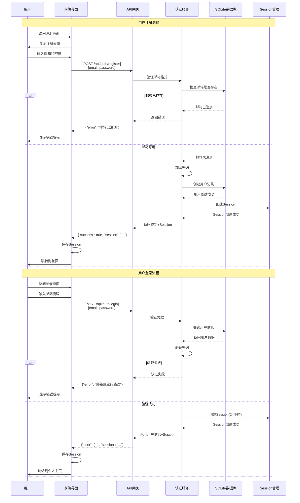
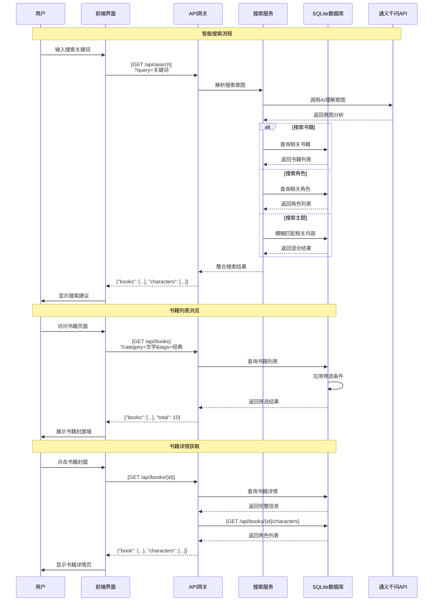
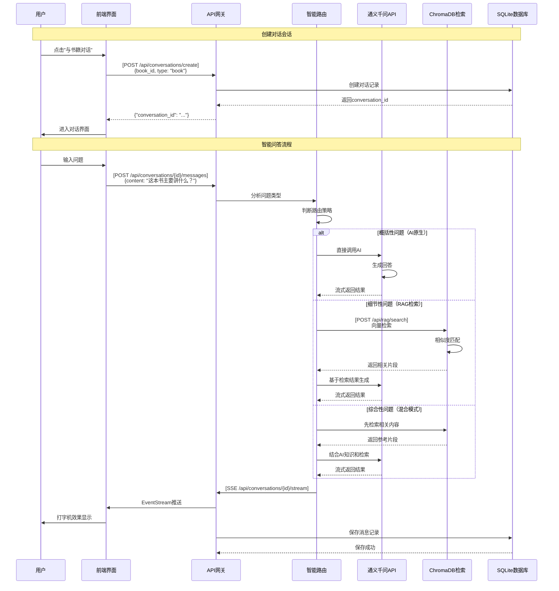
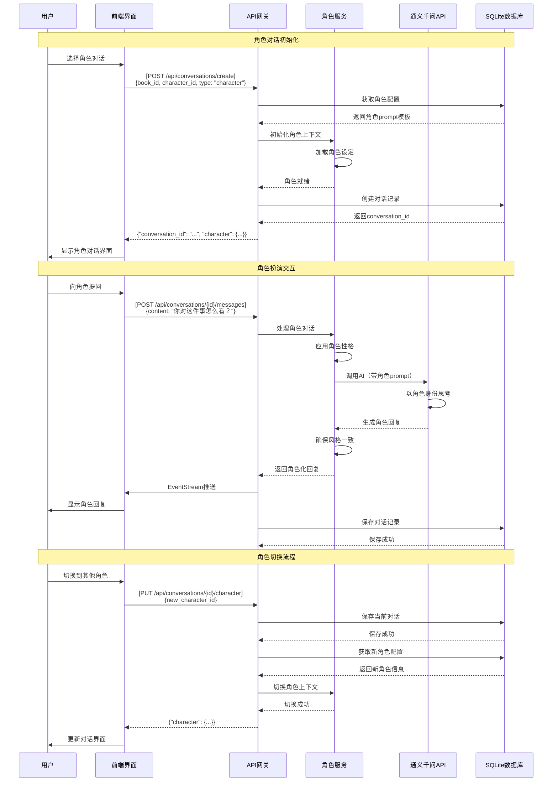
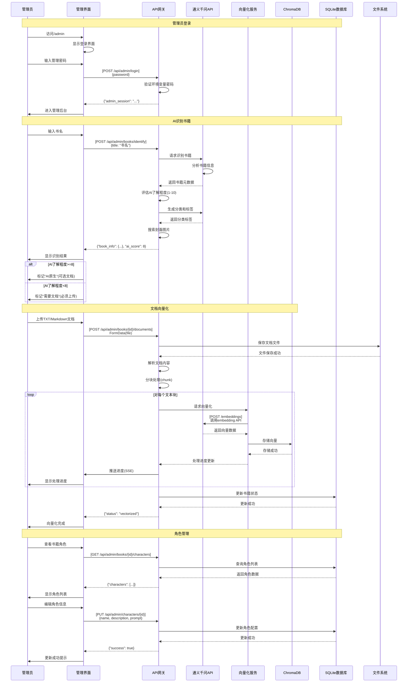
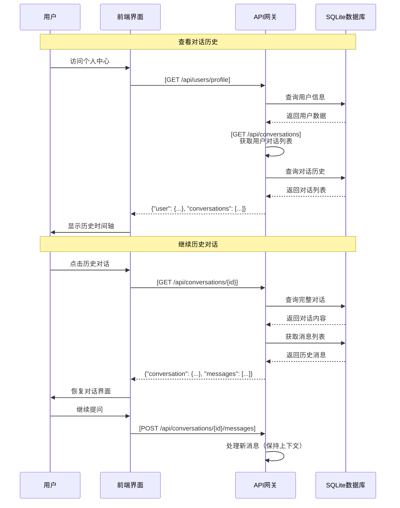

# InKnowing Sequence Diagram
## 基于业务逻辑守恒原理的时序交互设计

## 1. 用户注册登录时序 (AUTH_SEQUENCE)

## 2. 书籍浏览与搜索时序 (BROWSE_SEQUENCE)

## 3. 智能对话时序 (CHAT_SEQUENCE)

## 4. 角色对话时序 (CHARACTER_SEQUENCE)

## 5. 管理后台时序 (ADMIN_SEQUENCE)

## 6. 历史管理时序 (HISTORY_SEQUENCE)

## 时序图与其他视图的映射验证

### 业务逻辑守恒验证
1. **完整性检查**：每个用户旅程阶段都有对应的时序流程
2. **API一致性**：所有API调用与OpenAPI规范完全对应
3. **状态同步**：时序中的每个关键节点都对应状态转换

### 交叉引用映射表

| 时序流程 | 用户旅程映射 | 状态转换 | API端点 |
|---------|------------|---------|---------|
| AUTH_SEQUENCE | 发现与注册 | GUEST→REGISTERED | /api/auth/* |
| BROWSE_SEQUENCE | 探索书籍 | IDLE→BROWSING | /api/books/* |
| CHAT_SEQUENCE | 智能对话 | BROWSING→CONVERSING | /api/conversations/* |
| CHARACTER_SEQUENCE | 角色扮演 | CONVERSING→CHARACTER_MODE | /api/conversations/character |
| ADMIN_SEQUENCE | 管理员操作 | IDLE→ADMIN_MODE | /api/admin/* |
| HISTORY_SEQUENCE | 历史管理 | IDLE→REVIEWING | /api/conversations/history |

### 关键交互点标注
- #REF-REGISTER: 用户注册交互
- #REF-LOGIN: 用户登录交互
- #REF-SEARCH: 智能搜索交互
- #REF-CONV-CREATE: 对话创建交互
- #REF-SMART-CHAT: 智能路由决策
- #REF-CHAR-INIT: 角色初始化
- #REF-DOC-VECTOR: 文档向量化
- #REF-HISTORY-VIEW: 历史查看