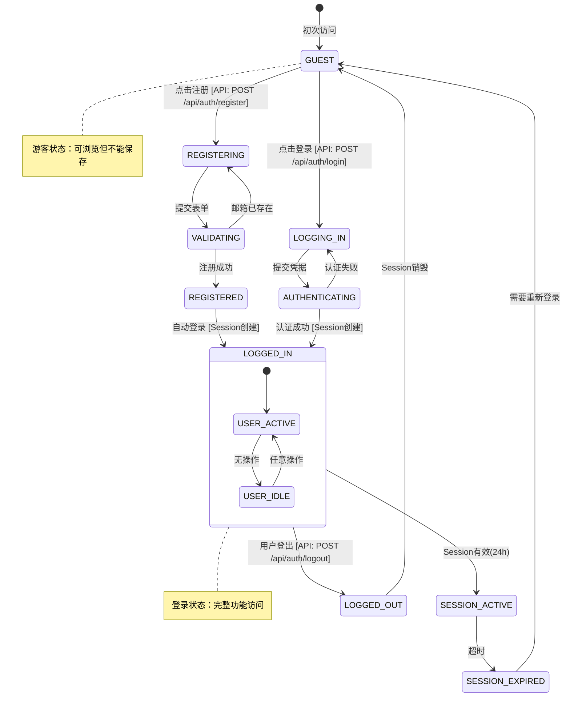
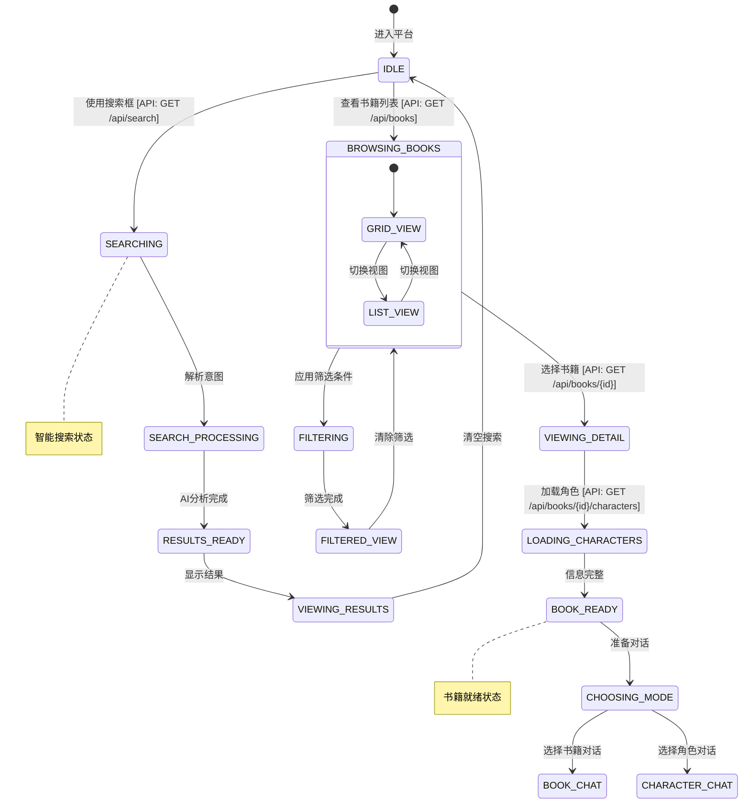
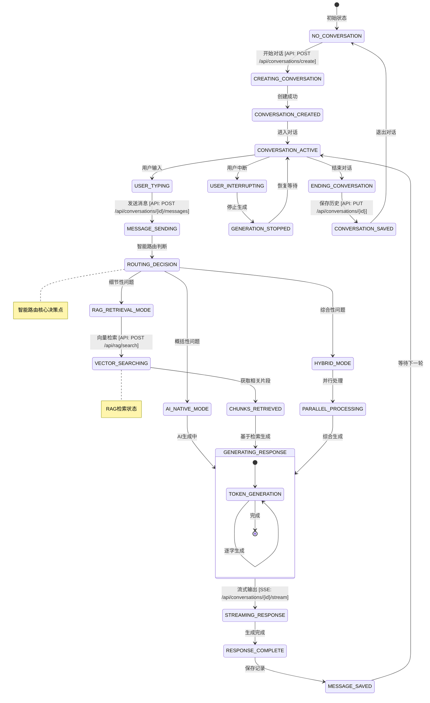
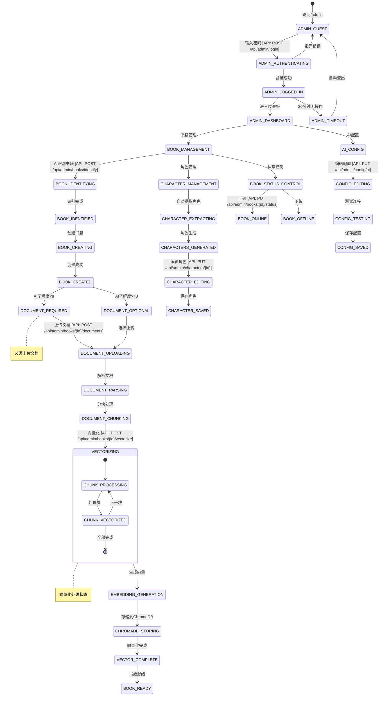
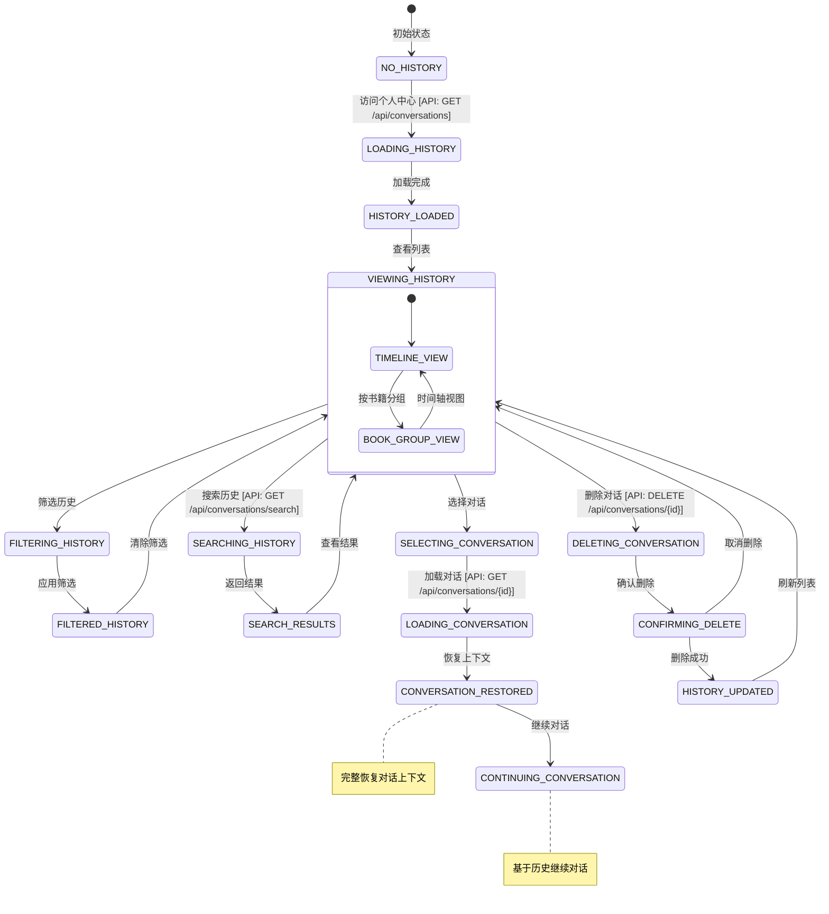

# InKnowing State Diagram
## 基于业务逻辑守恒原理的状态转换设计

## 1. 用户认证状态机 (AUTH_STATE_MACHINE)

## 2. 书籍浏览状态机 (BROWSE_STATE_MACHINE)

## 3. 对话交互状态机 (CONVERSATION_STATE_MACHINE)

## 4. 角色对话状态机 (CHARACTER_STATE_MACHINE)

```mermaid
stateDiagram-v2
    [*] --> NO_CHARACTER: 初始状态

    NO_CHARACTER --> SELECTING_CHARACTER: 选择角色
    SELECTING_CHARACTER --> LOADING_CHARACTER: 加载角色配置 [API: GET /api/characters/{id}]
    LOADING_CHARACTER --> CHARACTER_INITIALIZED: 角色就绪
    CHARACTER_INITIALIZED --> CHARACTER_CONVERSATION: 进入角色对话 [API: POST /api/conversations/create?character_id=]

    CHARACTER_CONVERSATION --> CHARACTER_LISTENING: 等待用户输入
    CHARACTER_LISTENING --> CHARACTER_THINKING: 接收消息 [API: POST /api/conversations/{id}/messages]
    CHARACTER_THINKING --> APPLYING_PERSONA: 应用角色设定
    APPLYING_PERSONA --> CHARACTER_GENERATING: 生成角色回复
    CHARACTER_GENERATING --> CHARACTER_RESPONDING: 流式输出回复
    CHARACTER_RESPONDING --> CHARACTER_RESPONSE_DONE: 回复完成
    CHARACTER_RESPONSE_DONE --> CHARACTER_CONVERSATION: 继续对话

    CHARACTER_CONVERSATION --> SWITCHING_CHARACTER: 切换角色 [API: PUT /api/conversations/{id}/character]
    SWITCHING_CHARACTER --> SAVING_CONTEXT: 保存当前对话
    SAVING_CONTEXT --> LOADING_NEW_CHARACTER: 加载新角色
    LOADING_NEW_CHARACTER --> CHARACTER_SWITCHED: 切换完成
    CHARACTER_SWITCHED --> CHARACTER_CONVERSATION: 新角色对话

    CHARACTER_CONVERSATION --> EXITING_CHARACTER: 退出角色模式
    EXITING_CHARACTER --> NO_CHARACTER: 返回普通模式

    state CHARACTER_CONVERSATION {
        [*] --> IN_CHARACTER
        IN_CHARACTER --> MAINTAINING_PERSONA: 保持角色性格
        MAINTAINING_PERSONA --> IN_CHARACTER: 持续扮演
    }

    note right of APPLYING_PERSONA: 严格遵循角色设定
    note right of CHARACTER_CONVERSATION: 沉浸式角色体验
```

## 5. 管理后台状态机 (ADMIN_STATE_MACHINE)

## 6. 对话历史状态机 (HISTORY_STATE_MACHINE)

## 状态转换与业务逻辑守恒验证

### 状态覆盖完整性检查

| 业务功能 | 状态机 | 初始状态 | 最终状态 | API触发点 |
|---------|--------|---------|----------|-----------|
| 用户注册 | AUTH_STATE_MACHINE | GUEST | LOGGED_IN | POST /api/auth/register |
| 用户登录 | AUTH_STATE_MACHINE | GUEST | LOGGED_IN | POST /api/auth/login |
| 书籍搜索 | BROWSE_STATE_MACHINE | IDLE | VIEWING_RESULTS | GET /api/search |
| 书籍对话 | CONVERSATION_STATE_MACHINE | NO_CONVERSATION | CONVERSATION_ACTIVE | POST /api/conversations/create |
| 角色对话 | CHARACTER_STATE_MACHINE | NO_CHARACTER | CHARACTER_CONVERSATION | POST /api/conversations/create?character_id= |
| 文档向量化 | ADMIN_STATE_MACHINE | DOCUMENT_UPLOADING | VECTOR_COMPLETE | POST /api/admin/books/{id}/vectorize |
| 查看历史 | HISTORY_STATE_MACHINE | NO_HISTORY | VIEWING_HISTORY | GET /api/conversations |

### 状态转换守恒验证

1. **状态完整性**: 每个业务流程都有明确的状态路径
2. **转换唯一性**: 每个状态转换都有唯一的触发条件
3. **API映射性**: 每个关键转换都对应具体的API调用
4. **可逆性验证**: 可以从状态图推导出完整的业务流程

### 关键状态标注

- **认证状态**: GUEST → LOGGED_IN (核心转换)
- **对话状态**: NO_CONVERSATION → CONVERSATION_ACTIVE (业务核心)
- **路由状态**: ROUTING_DECISION (智能决策点)
- **向量状态**: VECTORIZING (RAG核心处理)
- **角色状态**: CHARACTER_CONVERSATION (沉浸体验)